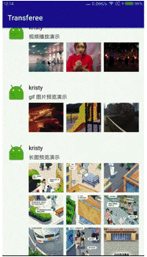
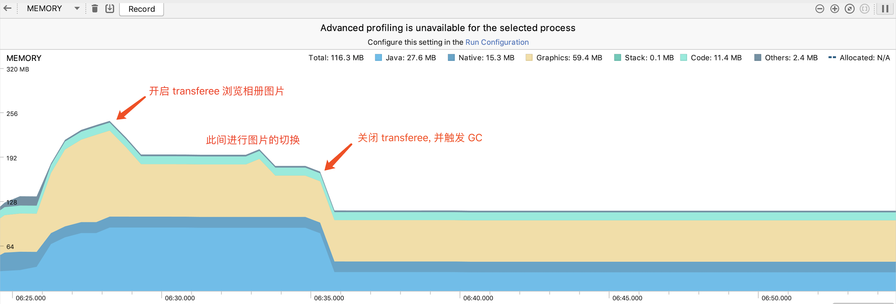

# PhotoViewer
PhotoViewer 一款功能超强的相册查看器。An awesome photo album viewer.

## 可以帮助你完成从缩略视图到原视图的无缝过渡转变, 优雅的浏览普通图片、长图、gif图、视频等不同格式的多媒体。
[](https://jitpack.io/#ITxiaoguang/PhotoViewer)

支持的功能:

+ 支持视频预览
+ 支持 Gif 图预览
+ 支持大长图预览
+ 支持拖拽关闭
+ 支持自定义页面索引指示器
+ 支持自定义资源加载进度条
+ 支持自定义图片加载器[目前已经有 UniversalImageLoader / GlideImageLoader / PicassoImageLoader]
+ 支持图片保存
+ 支持预览图片缩放，拖动，旋转等手势操作
+ 缩略图到大图或者大图到缩略图的无缝过渡动画，无缩略图信息时，自动改变动画的行为为平移过渡->加载大图->伸展图片动画
+ 支持傻瓜式绑定 RecyclerView / ListView / GridView / ImageView
+ 支持不绑定任何 View, 即可启动 photoViewer

新增支持：
+ 固定自定义View和自定义View监听控件事件
+ 跟随图片、跟随视频滚动的自定义View
+ 图片、视频长按回调
+ GlideImageLoader 支持自定义图片缓存路径
+ 拆分图片、视频资源

已解决（全局搜 FIX BUG）：
+ IM多布局情况下数组越界
+ 解决判断视频不友好
+ 图片无bitmap情况下，点开图片弹窗无内容
+ 放大再还原出现不能拖拽的bug

可拓展：
+ 图片单个二维码、多个二维码扫码（请参考堪比微信扫码框架：https://github.com/ITxiaoguang/MLKitScanner ）

todo:
+ 支持下载图片、视频、动态图
+ 支持区分图片、视频、gif类型
+ 支持得到当前页图片的bitmap
+ 更友好的视频播放器

todo拓展:
+ 播放视频时各种拓展，如：弹幕、倍数播放、画中画

## 你可以通过这个框架做什么？
+ IM里面的查看图片，查看原图功能。例如：高仿微信聊天查看图片。
+ 列表查看图片功能。例如：朋友圈里的查看图片。
+ 查看大图功能。例如：点击放大头像。
+ 相册查看图片功能。
+ 视频播放器。

如有任何问题欢迎提 Issues

# Preview


# Sample
[demo.apk](https://github.com/Hitomis/transferee/tree/master/preview/app-release.apk)




# Dependency
step1.
```
allprojects {
    repositories {
        ...
        maven { url 'https://jitpack.io' }
    }
}
```

step2.
```
// 添加所有 module  [包括 photoviewer、glideimageloader、picassoimageloader、universalimageloader]
implementation 'com.github.ITxiaoguang:PhotoViewer:1.0.0'

// 单独添加核心 module photoviewer, 之后至少还需要添加以下三种图片加载器中的一种
implementation 'com.github.ITxiaoguang.PhotoViewer:photoviewer:1.0.0'

// 添加 Glide 图片加载器 三选一
implementation 'com.github.ITxiaoguang.PhotoViewer:glideimageloader:1.0.0'

// 添加 Picasso 图片加载器 三选一
implementation 'com.github.ITxiaoguang.PhotoViewer:picassoimageloader:1.0.0'

// 添加 Universal 图片加载器 三选一
implementation 'com.github.ITxiaoguang.PhotoViewer:universalimageloader:1.0.0'
```

# Usage
如果针对单个 ImageView 使用，将非常简单：
```
PhotoViewer viewer = PhotoViewer.getDefault(context);
viewer.apply(TransferConfig.build()
        .setImageLoader(UniversalImageLoader.with(getApplicationContext()))
        .setSourceUrlList(SourceConfig.getMixingSourceGroup())
        .create()
).show());

// 离开页面不要忘记调用
viewer.destroy();
```


如果你需要更多的功能，下面是 photoViewer 完整的使用示例：

step 1: 一个页面只创建一个 photoViewer 示例 (建议写在 onCreate 方法中)
```
photoViewer = PhotoViewer.getDefault(context);
```

step 2: 为 photoViewer 创建参数配置器
```
TransferConfig config = TransferConfig.build()
       .setSourceImageList(sourceUrlList) // 资源 url 集合, String 格式
       .setSourceUriList(sourceUriList) // 资源 uri 集合， Uri 格式
       .setMissPlaceHolder(R.mipmap.ic_empty_photo) // 资源加载前的占位图
       .setErrorPlaceHolder(R.mipmap.ic_empty_photo) // 资源加载错误后的占位图
       .setProgressIndicator(new ProgressPieIndicator()) // 资源加载进度指示器, 可以实现 IProgressIndicator 扩展
       .setIndexIndicator(new NumberIndexIndicator()) // 资源数量索引指示器，可以实现 IIndexIndicator 扩展
       .setImageLoader(GlideImageLoader.with(getApplicationContext())) // 图片加载器，可以实现 ImageLoader 扩展
       .setBackgroundColor(Color.parseColor("#000000")) // 背景色
       .setDuration(300) // 开启、关闭、手势拖拽关闭、显示、扩散消失等动画时长
       .setOffscreenPageLimit(2) // 第一次初始化或者切换页面时预加载资源的数量，与 justLoadHitImage 属性冲突，默认为 1
       .setCustomView(customView) // 自定义视图，将放在 photoViewer 的面板上
       .setNowThumbnailIndex(index) // 缩略图在图组中的索引
       .enableJustLoadHitPage(true) // 是否只加载当前显示在屏幕中的的资源，默认关闭
       .enableDragClose(true) // 是否开启下拉手势关闭，默认开启
       .enableDragHide(false) // 下拉拖拽关闭时，是否先隐藏页面上除主视图以外的其他视图，默认开启
       .enableDragPause(false) // 下拉拖拽关闭时，如果当前是视频，是否暂停播放，默认关闭
       .enableHideThumb(false) // 是否开启当 photoViewer 打开时，隐藏缩略图, 默认关闭
       .enableScrollingWithPageChange(false) // 是否启动列表随着页面的切换而滚动你的列表，默认关闭
       .setOnLongClickListener(new PhotoViewer.OnTransfereeLongClickListener() { // 长按当前页面监听器
            @Override
            public void onLongClick(ImageView imageView, String imageUri, int pos) {
                saveImageFile(imageUri); // 使用 photoViewer.getFile(imageUri) 获取缓存文件保存，视频不支持
            }
        })
       .bindImageView(imageView, source) // 绑定一个 ImageView, 所有绑定方法只能调用一个
       .bindListView(listView, R.id.iv_thumb) // 绑定一个 ListView， 所有绑定方法只能调用一个
       .bindRecyclerView(recyclerView, R.id.iv_thumb)  // 绑定一个 RecyclerView， 所有绑定方法只能调用一个
```

step 3: 显示 photoViewer
```
photoViewer.apply(config).show();
```

step 4: 离开页面的时候需要销毁 photoViewer 中的资源，防止内存泄漏 (建议写在 onDestroy 方法中)
```
photoViewer.destroy()
```

# Config
| 属性 | 说明 |
| :--: | :--: |
| sourceUrlList | 将要预览的资源 url 集合, String 格式 |
| sourceUriList | 将要预览的资源 uri 集合， Uri 格式 |
| nowThumbnailIndex | 缩略图在图组中的索引, 如果你绑定了 ListView 或者 RecyclerView，这个属性是必须的，否则可以忽略; 亦或可以作为打开 photoViewer 时指定初始化显示页面的 position |
| offscreenPageLimit | 显示 photoViewer 时初始化加载的资源数量, 默认为1, 表示第一次加载3张(nowThumbnailIndex, nowThumbnailIndex + 1, nowThumbnailIndex - 1); 值为 2, 表示加载5张。依次类推 |
| missPlaceHolder | 缺省的占位图，资源 id 格式。资源未加载完成时默认显示的图片 |
| missDrawable | 缺省的占位图，Drawable 格式。资源未加载完成时默认显示的图片 |
| errorPlaceHolder | 加载错误的占位图，资源 id 格式。原图加载错误时显示的图片 |
| errorDrawable | 加载错误的占位图，Drawable 格式。原图加载错误时显示的图片 |
| backgroundColor | photoViewer 显示时，photoViewer 背景色 |
| duration | 开启、关闭、手势拖拽关闭、透明度动画显示、扩散消失等动画的时长 |
| justLoadHitPage | 是否只加载当前页面中的资源。如果设置为 true，那么只有当 photoViewer 切换到当前页面时，才会触发当前页面的加载动作，否则按 offscreenPageLimit 所设置的数值去做预加载和当前页面的加载动作，默认关闭 |
| enableDragClose | 是否支持向下拖拽关闭，默认开启 |
| enableDragHide | 拖拽关闭时是否隐藏除主视图以外的其他 view， 默认开启 |
| enableDragPause | 拖拽关闭时是否暂停当前页面视频播放， 默认关闭 |
| enableHideThumb | 是否开启当 photoViewer 打开时，隐藏缩略图，默认开启 |
| enableScrollingWithPageChange | 是否启动列表随着 page 的切换而滚动，仅仅针对绑定 RecyclerView/GridView/ListView 有效, 启动之后因为列表会实时滚动，缩略图 view 将不会出现为空的现象，从而保证关闭 photoViewer 时为过渡关闭动画， 默认关闭 |
| progressIndicator | 资源加载进度指示器 (默认内置 ProgressPieIndicator 和 ProgressBarIndicator)。可实现 IProgressIndicator 接口定义自己的资源加载进度指示器 |
| indexIndicator | 资源索引指示器 (默认内置 CircleIndexIndicator 和 NumberIndexIndicator)。可实现 IIndexIndicator 接口定义自己的资源索引指示器 |
| imageLoader | 资源加载器。可实现 ImageLoader 接口定义自己的图片加载器 |
| imageId | RecyclerView 或者 ListView 的 ItemView 中的 ImageView id|
| customView | 用户自定义的视图，放置在 photoViewer 显示后的面板之上 |
| listView | 如果你是使用的 ListView 或者 GridView 来排列显示图片，那么需要将你的 ListView 或者 GridView 传入 bindListView() 方法中 |
| recyclerView | 如果你使用的 RecyclerView 来排列显示图片，需要将 RecyclerView 传入 bindRecyclerView() 方法中 |
| imageView | 如果只想对单个 ImageView 使用此库的功能，或者界面上单个的 ImageView 是相册的封面，那么使用 bindImageView(...) 或者它的重载方法可以满足你的需求  |


# Method
| 方法 | 说明 |
| :--: | :--: |
| getDefault(context) | 获取 photoViewer 实例 |
| apply(config) | 将配置参数对象应用到 photoViewer 实例中 |
| show() | 打开/显示 photoViewer |
| show(listener) | 打开/显示 photoViewer，并监听显示/关闭状态 |
| isShown() | photoViewer 是否显示 |
| dismiss() | 关闭 photoViewer |
| clear() | 清除图片和视频等所有缓存文件 |
| destroy() | 销毁 photoViewer 使用到的资源， 防止内存泄漏 |
| getImageFile(url) | 获取与 url 对应的缓存图片 |
| setOnPhotoViewerStateChangeListener(listener) | 设置 photoViewer 显示/关闭状态改变的监听器 |

# Thanks
如果你觉得这个项目帮助到了你，对你项目的用户体验有提升，或者帮你解决了一些问题，可以给个 star。你的鼓励是我维护项目最大的动力。


# Licence
    Copyright 2017 Vans, Inc.

    Licensed under the Apache License, Version 2.0 (the "License");
    you may not use this file except in compliance with the License.
    You may obtain a copy of the License at

        http://www.apache.org/licenses/LICENSE-2.0

    Unless required by applicable law or agreed to in writing, software
    distributed under the License is distributed on an "AS IS" BASIS,
    WITHOUT WARRANTIES OR CONDITIONS OF ANY KIND, either express or implied.
    See the License for the specific language governing permissions and
    limitations under the License.
 


